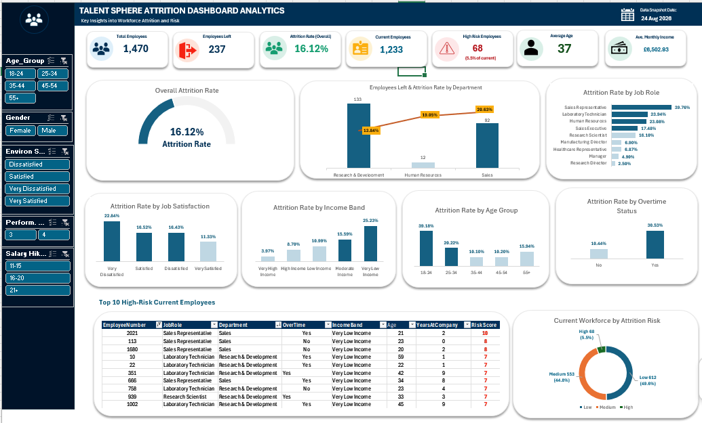
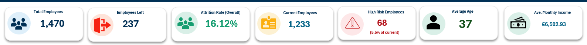
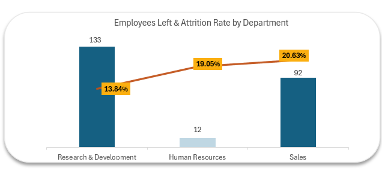
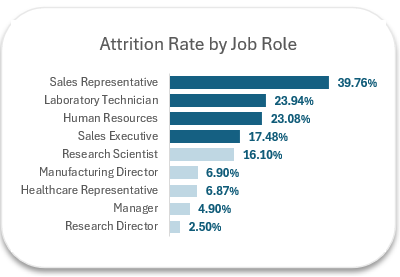
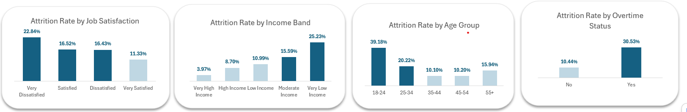
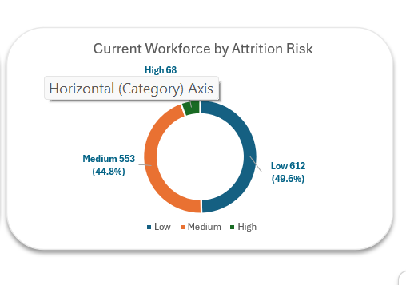
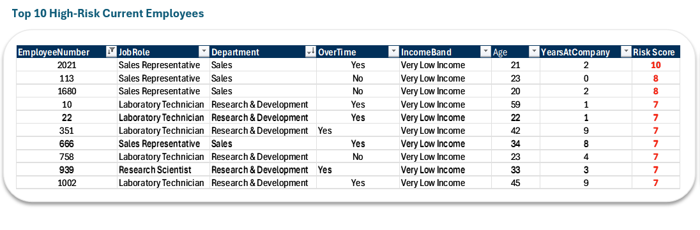
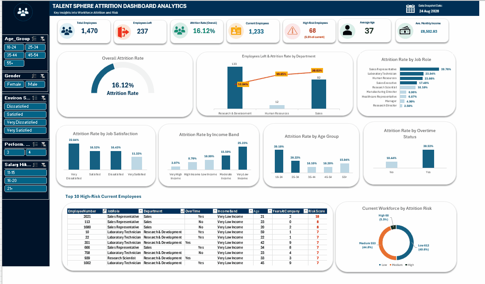

# 👥 Workforce Attrition Intelligence Dashboard

> **An interactive Human Resources analytics dashboard designed to analyse employee attrition, identify workforce risk factors, prioritise high-risk employees, and support evidence-based retention strategies through executive-level reporting.**



<!-- IMAGE PLACEHOLDERS / FILES TO ADD TO THE images/ FOLDER

dashboard.png               = Full dashboard, default/unfiltered state
dashboard.gif               = Short interactive dashboard demonstration
kpi-overview.png            = Executive KPI cards
department-performance.png  = Employees Left & Attrition Rate by Department
job-role-analysis.png       = Attrition Rate by Job Role
attrition-drivers.png       = Job Satisfaction, Income Band, Age Group and Overtime charts
risk-distribution.png       = Current Workforce by Attrition Risk
high-risk-employees.png     = Top 10 High-Risk Current Employees table

-->

---

## 📖 Executive Summary

Employee attrition represents a significant workforce challenge for organisations because repeated employee exits can increase recruitment costs, reduce productivity, disrupt team stability, and contribute to the loss of valuable institutional knowledge.

This project presents an interactive **Workforce Attrition Intelligence Dashboard** developed in Microsoft Excel to help HR leaders analyse employee turnover, understand the characteristics associated with attrition, and identify areas where targeted retention interventions may be required.

The analysis evaluates **1,470 employee records** across several workforce dimensions including department, job role, overtime, compensation, age, satisfaction, performance, and salary progression.

Rather than focusing solely on historical employee exits, the project also introduces a transparent **rule-based attrition risk scoring framework** designed to identify current employees displaying multiple characteristics associated with historically higher turnover.

The project follows a complete workforce analytics workflow including:

- Business problem analysis
- Data preparation and transformation
- Exploratory Data Analysis (EDA)
- Workforce segmentation
- KPI development
- PivotTable analysis
- Interactive dashboard design
- Employee risk prioritisation
- Executive reporting
- Strategic recommendation development

The final dashboard enables stakeholders to explore workforce patterns dynamically using slicers, PivotTables, PivotCharts, calculated helper fields, KPI cards, and an interactive high-risk employee table.

### Key Workforce Outcomes

- **Total Employees:** 1,470
- **Employees Who Left:** 237
- **Overall Attrition Rate:** 16.12%
- **Current Employees:** 1,233
- **High-Risk Current Employees:** 68
- **High-Risk Share of Current Workforce:** 5.5%
- **Average Employee Age:** 37
- **Average Monthly Income:** £6,502.93

One of the strongest operational signals identified in the analysis was **overtime**.

Employees working overtime recorded an attrition rate of **30.53%**, compared with only **10.44%** among employees who did not work overtime.

---

# 🏢 Business Scenario

## Background

TalentSphere Solutions Ltd. is a workforce analytics and HR consulting organisation focused on employee analytics, workforce intelligence, and data-driven HR solutions.

The organisation is experiencing employee attrition and workforce instability that may negatively affect productivity, recruitment costs, employee morale, and long-term organisational performance.

Although employee data was available across several HR dimensions, management required a more structured analytical solution capable of answering important workforce questions such as:

- Which employees are leaving?
- Which departments are experiencing the greatest turnover pressure?
- Which job roles have the highest attrition rates?
- Does overtime appear to influence employee exits?
- Are lower-paid employees leaving more frequently?
- Are younger employees more likely to leave?
- Does employee satisfaction appear related to attrition?
- Which current employees should HR prioritise for retention review?

The objective was therefore to transform employee-level HR data into an interactive workforce intelligence solution capable of supporting both descriptive analysis and proactive retention planning.

---

# 🎯 Business Problem

TalentSphere Solutions lacked a consolidated analytical solution capable of clearly identifying the factors associated with employee attrition.

This created several workforce management challenges.

Management had limited visibility into:

- where attrition was concentrated,
- which employee groups experienced the highest turnover,
- whether workload patterns such as overtime were associated with exits,
- how compensation related to retention,
- whether employee age influenced attrition,
- how satisfaction levels differed between employee groups,
- and which current employees exhibited multiple high-risk characteristics.

Without these insights, retention activities risked becoming broad and reactive rather than targeted and evidence-based.

The objective of this project was therefore to transform raw workforce data into an executive-level HR analytics dashboard capable of supporting faster, more focused workforce decisions.

---

# 🎯 Project Objectives

The primary objective of this project was to develop an interactive workforce analytics dashboard capable of helping HR leaders understand employee attrition and prioritise retention activity.

Specifically, the project was designed to:

- Measure the organisation's overall employee attrition rate.
- Compare employee exits across departments.
- Identify job roles with the highest attrition rates.
- Evaluate the relationship between overtime and employee exits.
- Analyse attrition across employee income groups.
- Determine whether younger employees leave more frequently.
- Evaluate attrition across job satisfaction levels.
- Segment current employees according to attrition risk.
- Identify high-risk employees requiring further HR review.
- Enable dynamic workforce exploration using interactive slicers.
- Present executive HR KPIs through a management-focused reporting interface.
- Translate analytical findings into actionable retention recommendations.

---

# 📊 Project Overview

This project demonstrates the practical application of **Human Resources Analytics and Business Intelligence using Microsoft Excel**.

The solution combines data preparation, helper-column engineering, PivotTables, PivotCharts, KPI reporting, employee segmentation, risk scoring, and interactive dashboard design.

Unlike a traditional static HR report, the dashboard allows users to dynamically investigate workforce patterns across several dimensions.

The dashboard provides visibility into:

- Employee attrition
- Current workforce size
- Department-level turnover
- Job-role attrition
- Overtime patterns
- Employee income
- Employee age
- Job satisfaction
- Workforce risk distribution
- High-risk employee prioritisation

By consolidating these areas into a single reporting interface, the solution provides leadership with a clearer understanding of where workforce retention challenges are concentrated.

---

# 📂 Dataset Overview

The dataset contains employee-level workforce records representing **1,470 employees** across multiple departments, job roles, compensation levels, experience levels, satisfaction scores, and employment characteristics.

Each record represents an individual employee and contains information relevant to workforce behaviour, employment history, compensation, performance, satisfaction, and attrition.

The dataset provides sufficient granularity to support both organisation-wide KPI monitoring and detailed employee segmentation.

## Dataset Features

The dataset includes information relating to:

- Employee demographics
- Department
- Job role
- Compensation
- Salary increases
- Overtime
- Performance
- Job satisfaction
- Environment satisfaction
- Work-life balance
- Employee tenure
- Total work experience
- Attrition status

Additional analytical fields were created during the project to support reporting, segmentation, and risk prioritisation.

---

# 📋 Key Variables

| Category | Example Fields |
|-----------|----------------|
| Employee Information | EmployeeNumber, Age, Gender |
| Employment Status | Attrition |
| Organisation | Department, JobRole |
| Compensation | MonthlyIncome, PercentSalaryHike |
| Workload | OverTime |
| Satisfaction | JobSatisfaction, EnvironmentSatisfaction |
| Performance | PerformanceRating |
| Experience | YearsAtCompany, YearsInCurrentRole, TotalWorkingYears |
| Work-Life Factors | WorkLifeBalance, DistanceFromHome |
| Risk Analytics | Attrition_Risk_Score, Attrition_Risk_Level, Risk_Sort_Key |

---

# 🧹 Data Preparation & Cleaning

Before analytical modelling and dashboard development, the dataset underwent a structured preparation process to ensure consistency, usability, and reporting accuracy.

The preparation stage included several important tasks.

## Data Validation

The employee dataset was reviewed to identify:

- Missing values
- Blank records
- Duplicate entries
- Incorrect data types
- Inconsistent categorical values
- Structural issues
- Formatting inconsistencies

This ensured that PivotTables and calculated metrics were based on reliable employee records.

---

## Data Standardisation

Categorical fields were standardised to improve reporting consistency.

Examples included:

- Attrition values
- Overtime values
- Department names
- Job role categories
- Satisfaction labels
- Age groups
- Income groups

Standardising these values prevented fragmented reporting caused by inconsistent categories.

---

## Feature Engineering

Several helper columns were created to support more meaningful analysis.

These included:

- Attrition Flag
- Age Group
- Income Band
- Job Satisfaction Label
- Attrition Risk Score
- Attrition Risk Level
- Risk Sort Key
- Salary Hike Group

These fields transformed raw employee variables into business-friendly analytical categories.

---

# 🧮 Analytical Helper Fields

## Attrition Flag

A binary attrition field was created to make percentage-based PivotTable analysis easier.

```excel
=IF([@Attrition]="Yes",1,0)
````

The average of this field represents the attrition rate for any selected workforce segment.

---

## Age Group

Employee ages were segmented into the following groups:

* 18-24
* 25-34
* 35-44
* 45-54
* 55+

This enabled attrition rates to be compared across different career stages.

---

## Income Band

Monthly income was grouped into five analytical categories:

* Very Low Income
* Low Income
* Moderate Income
* High Income
* Very High Income

These bands provided a clearer way to analyse compensation-related attrition patterns.

---

## Job Satisfaction Labels

The original numerical job satisfaction scale was converted into business-friendly categories:

* Very Dissatisfied
* Dissatisfied
* Satisfied
* Very Satisfied

This improved executive readability across the dashboard.

---

## Salary Hike Groups

Employee salary increases were also grouped into ranges to support interactive workforce filtering.

Examples include:

* 11-15%
* 16-20%
* 21%+

---

# 📈 Exploratory Data Analysis (EDA)

Before dashboard development, exploratory analysis was performed to identify patterns within the workforce data.

The purpose was not simply to visualise the dataset, but to understand which variables were most relevant to the business problem.

The analysis focused on seven key workforce questions:

* What is the overall attrition rate?
* Which departments and job roles have the highest turnover?
* Does overtime work correlate with attrition?
* How does salary influence employee exit?
* Are younger employees leaving more frequently?
* What is the relationship between job satisfaction and attrition?
* Which current employees should be prioritised for retention intervention?

These findings directly informed the KPI selection, dashboard visualisations, and risk-scoring methodology.

---

# 📊 Dashboard Development Process

The dashboard was developed using a structured analytics workflow designed to transform raw employee records into meaningful executive workforce insights.

The development process followed these key stages.

### 1. Business Understanding

The HR case study was reviewed to identify the key workforce questions that leadership needed the dashboard to answer.

---

### 2. Data Preparation

The source data was cleaned, validated, standardised, and enhanced with calculated helper fields.

---

### 3. Exploratory Analysis

PivotTables were created to compare attrition across different workforce dimensions.

The exploratory analysis was used to identify meaningful KPIs and visualisations.

---

### 4. Feature Engineering

Additional analytical fields were created to support:

* employee segmentation,
* attrition-rate calculations,
* risk scoring,
* risk classification,
* employee ranking,
* and interactive dashboard filtering.

---

### 5. Dashboard Design

The dashboard was designed around executive usability.

Particular attention was given to:

* KPI visibility
* Visual hierarchy
* Colour consistency
* Dashboard spacing
* Chart readability
* Business interpretation
* Slicer usability
* Management-level presentation

---

### 6. Interactive Reporting

Interactive slicers were added to allow decision-makers to explore workforce patterns dynamically.

Changing a slicer automatically updates connected PivotTables, PivotCharts, KPIs, workforce-risk calculations, and employee-level risk outputs.

---

# 🛠️ Tools & Technologies

This project was developed primarily using Microsoft Excel and demonstrates several Business Intelligence and workforce analytics techniques.

### Software

* Microsoft Excel
* Microsoft PowerPoint

### Excel Features

* PivotTables
* PivotCharts
* Slicers
* Structured Tables
* IFS
* IF
* COUNTIFS
* GETPIVOTDATA
* Calculated Helper Columns
* Conditional Formatting
* Data Validation
* Custom Number Formatting
* Linked Dashboard Elements

### Analytics Skills

* Data Cleaning
* Data Transformation
* Exploratory Data Analysis
* Workforce Segmentation
* KPI Development
* HR Analytics
* Risk Scoring
* Interactive Dashboard Design
* Executive Reporting
* Data Storytelling

---

# 📊 Executive Dashboard Walkthrough

The Workforce Attrition Intelligence Dashboard was designed to provide leadership with a consolidated view of employee turnover while allowing HR stakeholders to investigate different workforce segments dynamically.

Rather than relying on multiple static HR reports, the dashboard combines executive KPI cards, interactive slicers, PivotCharts, risk segmentation, and employee-level prioritisation within a single reporting environment.

Each visual was selected to answer a specific business question.

---

# 🎯 Executive KPI Cards



The dashboard begins with executive KPIs that provide an immediate overview of workforce status.

| KPI                        |        Result | Business Purpose                                                  |
| -------------------------- | ------------: | ----------------------------------------------------------------- |
| **Total Employees**        |     **1,470** | Represents the complete workforce population within the dataset.  |
| **Employees Left**         |       **237** | Measures the total number of recorded employee exits.             |
| **Overall Attrition Rate** |    **16.12%** | Shows the proportion of employees who left the organisation.      |
| **Current Employees**      |     **1,233** | Represents employees still with the organisation.                 |
| **High-Risk Employees**    |        **68** | Identifies current employees requiring priority retention review. |
| **Average Age**            |        **37** | Provides an overview of workforce age composition.                |
| **Average Monthly Income** | **£6,502.93** | Shows average employee compensation across the workforce.         |

These KPIs update automatically when dashboard filters are applied.

---

# 🎛 Interactive Dashboard Features

The dashboard includes focused interactive slicers that enable users to investigate workforce characteristics without creating multiple reports.

### Available Interactive Filters

* Age Group
* Gender
* Environment Satisfaction
* Performance Rating
* Salary Hike (%)

These filters allow HR stakeholders to observe how workforce KPIs, attrition drivers, and employee risk profiles change across different employee segments.

---

# 📈 Dashboard Visualisations

Each dashboard visual supports a specific workforce question.

---

## 1. Overall Attrition Rate

### Business Question

> What is the overall employee attrition rate?

### Dashboard Purpose

The dashboard uses an executive gauge visual to provide an immediate view of organisation-wide attrition.

The analysis identified:

* **1,470 total employees**
* **237 employee exits**
* **16.12% overall attrition**

This means approximately **one in every six employees** represented in the dataset had left the organisation.

### Business Value

This KPI provides HR leaders with a baseline against which individual departments, roles, and workforce groups can be compared.

---

## 2. Department Attrition Analysis



### Business Question

> Which departments experience the greatest turnover?

### Dashboard Purpose

A combination chart compares:

* the absolute number of employees who left,
* and the attrition rate within each department.

| Department             | Employees Left | Attrition Rate |
| ---------------------- | -------------: | -------------: |
| Research & Development |        **133** |     **13.84%** |
| Human Resources        |         **12** |     **19.05%** |
| Sales                  |         **92** |     **20.63%** |

### Key Insight

**Sales records the highest departmental attrition rate at 20.63%.**

However, **Research & Development records the highest absolute number of employee exits at 133**.

This distinction is important.

A high **rate** identifies proportional retention risk, while high **volume** represents the overall number of employees lost.

### Business Value

The visual enables leadership to distinguish between:

* departments with high proportional turnover,
* and departments producing the greatest absolute workforce loss.

This supports more targeted workforce planning.

---

## 3. Job Role Attrition



### Business Question

> Which job roles have the highest attrition rates?

### Dashboard Purpose

The job-role analysis compares attrition rates across specific workforce roles.

The highest attrition rates include:

| Job Role              | Attrition Rate |
| --------------------- | -------------: |
| Sales Representative  |     **39.76%** |
| Laboratory Technician |     **23.94%** |
| Human Resources       |     **23.08%** |
| Sales Executive       |     **17.48%** |
| Research Scientist    |     **16.10%** |

### Key Insight

**Sales Representatives record the highest attrition rate at 39.76%.**

This is approximately **2.5 times the organisation-wide attrition rate of 16.12%**.

### Business Value

This allows HR leaders to identify specific roles where targeted retention strategies may produce greater impact than broad organisation-wide initiatives.

---

## 4. Overtime Analysis

### Business Question

> Does working overtime appear to be associated with employee attrition?

### Dashboard Purpose

Employees were divided according to whether they regularly worked overtime.

| Overtime | Employees | Employees Left | Attrition Rate |
| -------- | --------: | -------------: | -------------: |
| No       |     1,054 |            110 |     **10.44%** |
| Yes      |       416 |            127 |     **30.53%** |

### Key Insight

Employees working overtime experience nearly:

### **3× the attrition rate**

of employees who do not work overtime.

### Business Value

Overtime represents one of the most actionable operational signals within the dataset.

Management can investigate:

* workload distribution,
* staffing levels,
* sustained overtime,
* manager-level workload patterns,
* and operational capacity.

---

## 5. Income Band Analysis

### Business Question

> How does employee income influence attrition?

### Dashboard Purpose

Employees were grouped into income bands to compare attrition across compensation levels.

| Income Band      | Attrition Rate |
| ---------------- | -------------: |
| Very Low Income  |     **25.23%** |
| Moderate Income  |     **15.59%** |
| Low Income       |     **10.99%** |
| High Income      |      **8.70%** |
| Very High Income |      **3.97%** |

### Key Insight

Employees in the **Very Low Income** category experience the highest attrition rate.

The Very High Income group records the lowest attrition rate at **3.97%**.

### Business Value

The analysis suggests compensation positioning should be investigated as part of the wider employee retention strategy.

---

## 6. Age Group Analysis

### Business Question

> Are younger employees leaving more frequently?

### Dashboard Purpose

Employees were grouped according to age to identify differences in attrition across career stages.

| Age Group | Attrition Rate |
| --------- | -------------: |
| 18-24     |     **39.18%** |
| 25-34     |     **20.22%** |
| 55+       |     **15.94%** |
| 45-54     |     **10.20%** |
| 35-44     |     **10.10%** |

### Key Insight

Employees aged **18-24 record the highest attrition rate at 39.18%**.

The 25-34 age group also exceeds the organisation-wide attrition rate.

### Business Value

The findings indicate that early-career employee retention should receive greater attention.

Possible areas for investigation include:

* onboarding,
* development opportunities,
* career progression,
* mentoring,
* manager support,
* and compensation expectations.

---

## 7. Job Satisfaction Analysis

### Business Question

> What is the relationship between Job Satisfaction and Attrition?

### Dashboard Purpose

The original satisfaction scores were converted into business-friendly categories for easier interpretation.

| Job Satisfaction  | Attrition Rate |
| ----------------- | -------------: |
| Very Dissatisfied |     **22.84%** |
| Satisfied         |     **16.52%** |
| Dissatisfied      |     **16.43%** |
| Very Satisfied    |     **11.33%** |

### Key Insight

Employees classified as **Very Dissatisfied** have the highest attrition rate.

The **Very Satisfied** workforce segment has the lowest attrition rate at **11.33%**.

### Business Value

Satisfaction data can help HR identify teams where employee experience, management practices, recognition, or job design may require further investigation.

---

## Attrition Driver Overview



The combined analysis highlights four workforce segments that consistently stand out:

* employees working overtime,
* younger employees,
* employees within the lowest income band,
* and employees reporting very low job satisfaction.

Among these, overtime represents the strongest immediately actionable operational signal.

---

# ⚠️ Employee Attrition Risk Prioritisation

Historical attrition analysis explains where employee exits have occurred.

However, HR leaders also require a way to identify which **current employees** may deserve additional retention attention.

To support this, a transparent **rule-based Attrition Risk Score** was developed.

The model does not attempt to predict exactly who will resign.

Instead, it combines workforce characteristics associated with historically higher attrition to create a prioritisation framework.

---

# 🧮 Attrition Risk Score

The following factors contribute to the risk score:

| Risk Factor             | Score |
| ----------------------- | ----: |
| Employee works overtime |    +2 |
| Age 18-24               |    +2 |
| Age 25-34               |    +1 |
| Very Low Income         |    +2 |
| Low Income              |    +1 |
| Very Dissatisfied       |    +2 |
| Sales Representative    |    +2 |
| Laboratory Technician   |    +1 |
| Human Resources         |    +1 |

Employees who had already left the organisation were excluded from current employee risk prioritisation.

---

# 🚦 Risk Classification

Employees were grouped into three risk levels.

| Risk Score | Risk Level |
| ---------: | ---------- |
|        0-2 | Low        |
|        3-5 | Medium     |
|         6+ | High       |

---

## Current Workforce Risk Distribution



The current employee population was distributed as follows:

| Risk Level | Current Employees | Workforce Share |
| ---------- | ----------------: | --------------: |
| Low        |           **612** |       **49.6%** |
| Medium     |           **553** |       **44.8%** |
| High       |            **68** |        **5.5%** |

### Key Insight

Only **68 of the 1,233 current employees** fall within the High-Risk category.

This represents approximately:

### **5.5% of the current workforce**

Rather than treating every employee as equally likely to leave, HR can use this group as a prioritised population for further investigation.

---

# 🎯 Dynamic High-Risk Employee Prioritisation

Identifying high-risk employees introduced an additional analytical challenge.

Multiple employees frequently shared the same risk score, meaning a traditional PivotTable **Top 10** filter could return more than ten employees because of ties.

To solve this, a unique `Risk_Sort_Key` was created.

```excel
=IF(
    [@[Attrition_Risk_Level]]<>"High",
    "",
    [@[Attrition_Risk_Score]]*10000-[@EmployeeNumber]
)
```

The score remains the primary ranking criterion while `EmployeeNumber` provides a deterministic tie-breaker.

This allows the dashboard to produce a dynamic list of the highest-risk current employees while still responding correctly to slicer selections.

---

## Top High-Risk Current Employees



### Dashboard Purpose

The employee-level table allows HR teams to investigate high-risk employees using attributes such as:

* Employee Number
* Job Role
* Department
* Overtime
* Income Band
* Age
* Years at Company
* Risk Score

### Business Value

The table converts workforce analytics into an actionable retention workflow.

Rather than only identifying patterns at aggregate level, HR can identify individual employees who may require:

* manager review,
* workload assessment,
* compensation review,
* development discussion,
* satisfaction follow-up,
* or targeted retention outreach.

---

# 📌 Dashboard Design Philosophy

The dashboard was designed using several Business Intelligence principles intended to maximise usability while reducing reporting complexity.

---

## Executive First

The most important workforce metrics appear at the top of the dashboard through KPI cards.

This allows stakeholders to understand workforce status immediately before investigating detailed patterns.

---

## Interactive Exploration

The dashboard encourages investigation through slicers rather than relying on multiple static reports.

Users can explore specific employee segments without modifying the underlying data or PivotTables.

---

## Progressive Analysis

The dashboard follows a natural analytical flow:

Executive KPIs

↓

Overall Attrition

↓

Department Analysis

↓

Job Role Analysis

↓

Attrition Drivers

↓

Current Workforce Risk

↓

High-Risk Employee Prioritisation

This enables stakeholders to move from organisation-level insights to employee-level action.

---

## Visual Consistency

Consistent colours, typography, card layouts, and chart formatting improve readability and create a professional executive reporting experience.

The dashboard uses a consistent visual language across:

* KPI cards,
* combination charts,
* bar charts,
* attrition gauge,
* risk distribution,
* slicers,
* and employee-level tables.

---

# 📸 Dashboard Preview

## Executive Dashboard


---

## Interactive Dashboard Demonstration



---

# 💡 Key Analytical Capabilities

The dashboard enables stakeholders to:

* Monitor overall workforce attrition.
* Compare employee exits across departments.
* Identify high-turnover job roles.
* Analyse workload and overtime patterns.
* Evaluate attrition across income bands.
* Investigate early-career employee turnover.
* Compare attrition across satisfaction levels.
* Segment the current workforce by attrition risk.
* Identify high-risk employees dynamically.
* Explore employee groups interactively through slicers.
* Support evidence-based retention planning.

---

# 💡 Executive Business Insights

The dashboard provides a comprehensive view of workforce attrition while highlighting several important employee retention patterns.

---

## 1. Attrition is not evenly distributed across the organisation.

The organisation-wide attrition rate is **16.12%**, but several departments and employee groups experience substantially higher rates.

This indicates that broad organisation-wide retention strategies may be less effective than targeted interventions.

---

## 2. Sales has the highest departmental attrition rate.

Sales records an attrition rate of **20.63%**, compared with:

* Human Resources — 19.05%
* Research & Development — 13.84%

This suggests that Sales should remain a priority area for retention investigation.

---

## 3. Research & Development produces the highest volume of employee exits.

Although R&D has the lowest departmental attrition rate, it accounts for **133 employee exits**, the highest absolute number.

This demonstrates why both attrition rate and attrition volume should be considered in workforce decision-making.

---

## 4. Sales Representatives represent the highest-risk job role.

Sales Representatives record an attrition rate of **39.76%**.

This is approximately 2.5 times the overall company rate.

Targeted role-level investigation is therefore warranted.

---

## 5. Overtime is the clearest actionable workforce signal.

Employees working overtime record **30.53% attrition**, compared with **10.44%** among employees who do not work overtime.

The difference suggests that workload and sustained overtime should be investigated as potential retention pressure points.

---

## 6. Younger employees experience substantially higher attrition.

Employees aged 18-24 record a **39.18% attrition rate**.

Employees aged 25-34 also record an elevated rate of **20.22%**.

This highlights a potential early-career retention challenge.

---

## 7. Lower income is associated with higher attrition.

Employees within the Very Low Income segment experience **25.23% attrition**.

The Very High Income segment records only **3.97%**.

While the analysis does not establish causation, compensation should be investigated as part of the wider retention strategy.

---

## 8. Very dissatisfied employees are more likely to leave.

Employees classified as Very Dissatisfied record **22.84% attrition**.

The Very Satisfied group records only **11.33%**.

Employee experience and satisfaction should therefore remain important components of workforce monitoring.

---

## 9. Current workforce risk is concentrated enough for targeted action.

Only **68 current employees** are classified as High Risk.

This represents approximately **5.5% of the current workforce**.

The relatively concentrated risk population makes targeted HR intervention operationally manageable.

---

## 10. Interactive workforce reporting improves HR decision-making.

Rather than producing multiple static reports, HR stakeholders can investigate employee groups dynamically through interactive slicers.

This reduces reporting complexity while improving analytical flexibility.

---

# 📋 Strategic Recommendations

Based on the analysis, several opportunities exist to improve workforce retention.

---

## Reduce Avoidable Overtime

Overtime represents the strongest actionable operational signal identified in the analysis.

HR and operational leadership should:

* monitor overtime by department,
* identify sustained overtime patterns,
* review staffing levels,
* evaluate workload distribution,
* investigate manager-level workload concentration,
* and reduce avoidable overtime where possible.

---

## Strengthen Early-Career Retention

Employees aged 18-34 experience elevated attrition.

Recommended interventions include:

* structured onboarding,
* 30/60/90-day employee check-ins,
* mentoring programmes,
* clearer career progression,
* development plans,
* regular manager feedback,
* and stay interviews.

---

## Prioritise High-Risk Job Roles

Retention reviews should prioritise roles experiencing the highest attrition rates, particularly:

* Sales Representatives
* Laboratory Technicians
* Human Resources roles

Role-specific retention strategies may be more effective than broad workforce programmes.

---

## Investigate Compensation Positioning

The higher attrition rate among Very Low Income employees suggests that compensation should be reviewed alongside other workforce factors.

Possible actions include:

* market salary benchmarking,
* pay-equity reviews,
* examination of pay compression,
* salary progression reviews,
* and role-level compensation analysis.

---

## Improve Employee Satisfaction Monitoring

Employees reporting very low job satisfaction experience higher attrition.

HR should combine quantitative dashboard analysis with qualitative employee feedback.

Possible interventions include:

* engagement surveys,
* employee listening sessions,
* manager reviews,
* recognition programmes,
* role-design improvements,
* and development conversations.

---

## Use Risk Scores as a Retention Prioritisation Tool

High-Risk employees should not automatically be assumed to be leaving.

The risk score should instead support further investigation.

The 68 High-Risk employees may be prioritised for:

* retention conversations,
* manager check-ins,
* workload review,
* compensation assessment,
* career discussions,
* employee satisfaction follow-up,
* and workforce planning.

---

# 📈 Business Impact

The Workforce Attrition Intelligence Dashboard demonstrates how Human Resources data can be transformed into meaningful workforce insights.

By consolidating workforce information into a single interactive reporting solution, the dashboard enables stakeholders to:

* Monitor employee attrition through executive KPIs.
* Identify departments experiencing retention challenges.
* Compare attrition across job roles.
* Investigate workload-related workforce risks.
* Analyse compensation and demographic patterns.
* Prioritise high-risk employees.
* Reduce reliance on manual HR reporting.
* Support faster and more informed workforce decisions.
* Move from reactive reporting toward proactive retention planning.

Rather than simply reporting how many employees have already left, the solution helps leadership determine:

> **Where should retention efforts be focused next?**

---

# 🎯 Executive Use Cases

The dashboard was designed to support multiple organisational stakeholders.

## Chief Executive Officer / Senior Leadership

Monitors workforce stability, overall attrition, and organisational risk to support long-term strategic planning.

---

## HR Director

Uses workforce insights to prioritise retention initiatives, compensation reviews, employee engagement programmes, and workforce planning.

---

## HR Business Partner

Analyses attrition patterns across specific employee groups, departments, and job roles.

---

## Department Manager

Investigates workforce turnover, employee workload, overtime, and retention risks within their area of responsibility.

---

## Talent & Retention Team

Uses the high-risk employee view to prioritise targeted retention outreach and employee engagement activities.

---

## Finance / Workforce Planning

Uses employee attrition insights to better understand workforce stability, recruitment demand, and potential replacement-cost pressure.

---

# ⚠️ Analytical Limitations

This project is primarily a **descriptive and diagnostic workforce analytics solution**.

The dataset represents a workforce snapshot rather than a longitudinal employee history.

As a result, the project does **not** contain sufficient historical outcome data to validate whether an individual employee will leave within a specific future period.

Therefore:

> **The High-Risk classification should be interpreted as a prioritisation score rather than an employee's probability of leaving within the next six months.**

The analysis also identifies associations rather than causal relationships.

For example:

Employees working overtime experience substantially higher attrition.

However, the available dataset alone cannot establish that overtime directly caused employees to leave.

The findings should therefore be used to prioritise further investigation rather than treated as causal proof.

---

# 🛠️ Technical Skills Demonstrated

This project demonstrates practical workforce analytics capabilities across the complete analytics lifecycle.

### Human Resources Analytics

* Employee Attrition Analysis
* Workforce Segmentation
* Retention Analytics
* Employee Risk Prioritisation
* Job Role Analysis
* Satisfaction Analysis
* Compensation Analysis
* Workforce Planning

---

### Business Intelligence

* Executive Dashboard Development
* KPI Design
* Interactive Reporting
* Business Storytelling
* Decision Support
* Executive Reporting

---

### Data Analytics

* Exploratory Data Analysis
* Data Cleaning
* Data Transformation
* Feature Engineering
* Risk Segmentation
* Demographic Analysis
* Workforce Trend Analysis

---

### Microsoft Excel

* PivotTables
* PivotCharts
* Slicers
* GETPIVOTDATA
* IFS
* IF
* COUNTIFS
* Structured Tables
* Conditional Formatting
* Calculated Helper Columns
* Dashboard Design
* Interactive Reporting

---

### Professional Skills

* Analytical Thinking
* Business Problem Solving
* HR Decision Support
* Executive Communication
* Data Visualisation
* Strategic Recommendation Development
* Data Storytelling

---

# 🚀 Future Improvements

Several enhancements could extend the capabilities of this workforce analytics solution.

### Predictive Analytics

* Collect historical monthly workforce snapshots.
* Track employee exits over time.
* Develop a true attrition propensity model.
* Compare logistic regression and tree-based classification models.
* Evaluate model precision and recall.
* Measure ROC-AUC.
* Evaluate probability calibration.

---

### Workforce Analytics

* Analyse manager-level attrition.
* Monitor internal mobility.
* Track promotion patterns.
* Add tenure-based survival analysis.
* Analyse employee engagement over time.
* Measure retention intervention effectiveness.

---

### Business Intelligence

* Develop a Power BI version with drill-through analysis.
* Publish dashboards through Power BI Service.
* Introduce department-level detail pages.
* Add employee-risk trend monitoring.

---

### Data Integration

* Connect the reporting solution to an HR database.
* Automate dataset refreshes.
* Integrate employee survey data.
* Introduce scheduled reporting pipelines.

---

# 📊 Presentation Deliverable

In addition to the Excel dashboard, the project includes an executive PowerPoint presentation summarising:

* overall workforce KPIs,
* department and job-role attrition,
* major attrition drivers,
* current workforce risk exposure,
* high-risk employee prioritisation,
* strategic retention recommendations,
* methodology,
* analytical limitations,
* and future development opportunities.

The presentation is available within the repository:

```text
presentation/
└── Presentation.pptx
```

---

# 📁 Repository Structure

```text
workforce-attrition-intelligence-dashboard/
│
├── README.md
│
├── HR-Employee-Attrition.xlsx
│
├── dashboard/
│   └── HR-Employee-Attrition.xlsx
│
├── presentation/
│   └── Presentation.pptx
│
└── images/
    ├── dashboard.png
    ├── dashboard.gif
    ├── kpi-overview.png
    ├── department-performance.png
    ├── job-role-analysis.png
    ├── attrition-drivers.png
    ├── risk-distribution.png
    └── high-risk-employees.png
```

---

# 🎓 Key Takeaways

This project reinforced several important workforce analytics and Business Intelligence principles.

* Business questions should guide dashboard design.
* Attrition rates should be analysed alongside absolute employee exits.
* Aggregate company averages can hide important workforce segments.
* Interactive reporting significantly improves analytical flexibility.
* Risk scoring can help prioritise employee retention activity.
* Associations should not automatically be interpreted as causation.
* Descriptive analytics and predictive modelling serve different purposes.
* Effective dashboards should translate data into business decisions rather than simply display charts.
* Workforce analytics is most valuable when analytical insight leads to targeted organisational action.

Ultimately, this project demonstrates how employee data can be transformed into an executive workforce intelligence solution that moves HR reporting from:

> **“Who has already left?”**

towards:

> **“Where should we focus our retention efforts next?”**
